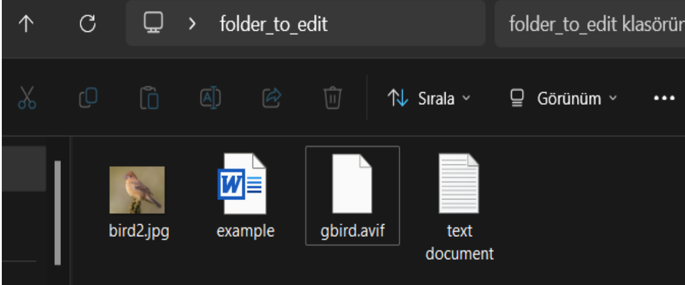
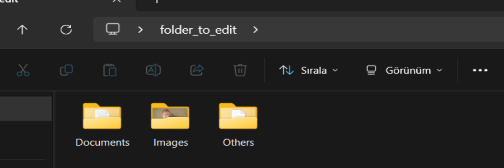

# File Organizer Project

This File Organizer project is aimed at automating the process of organizing files in a specified directory. It scans the target directory, categorizes files based on their types (such as images, documents, videos, etc.), and moves them to respective folders within the target directory. This project is beneficial for maintaining a clean and organized file structure, making it easier to manage and access files.

## Features
- Scans a directory for files.
- Categorizes files based on their types.
- Moves files to respective folders within the directory.
- Handles various file types like images, documents, videos, etc.



## Usage
- Specify the target directory to be organized.
- Run the Python script to organize the files.



## Technologies Used

- Python 3.x
- OS module for file operations
- shutil module for file movement

## Installation

1. Clone the repository to your local machine:

   ```bash
   git clone https://github.com/your-username/file-organizer-project.git

2. Navigate to the project directory:

   cd file-organizer

3. Run the Python script with the target directory path:

   python organize_files.py /path/to/your/target/directory

!!! do not forget write your folder name instead of target directory


## Website

For more information about the project, visit my website 

(https://sametyolcu.com/file-organiser-project).

### Using Raw String for File Paths

It's important to use raw string when specifying file paths in this project. Raw string allows you to use the escape character (\) in file paths without interpreting it as a special character in Python. By using raw string, you can specify file paths in a safer and more understandable way.


video for how to write 'r' 

(https://www.loom.com/share/8e7710cb046c402fa14e4280c1ad35b6?sid=d2ea18d5-298c-4632-9286-50039d9f46e0).


.png)

Example usage:
```python
target_directory = r"C:\Users\MONSTER SAMET\Desktop\folder_to_edit"


