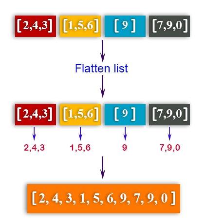

# Flatten List Project

This Python project contains a function that flattens nested lists.

## Project Description

This project includes a `flatten` function that flattens nested lists. The function iterates through each element in a given list, flattening nested lists and returning a single-level list.





## Usage

1. Clone the project files to your local machine:

   ```bash
    git clone https://github.com/your-username/flatten-list-project.git


2. Navigate to the project directory:
   
    cd flatten-list-project

3. Execute the Python file to reverse a list:

    python flatten.py

Enter a nested list as input and observe the function output. Example input and output:

Input: '[[1,'a',['cat'],2],[[[3]],'dog'],4,5]'

Output: '[1, 'a', 'cat', 2, 3, 'dog', 4, 5]'


## Website

For more information about the project, visit my website (https://www.sametyolcu.com/portfolio).


