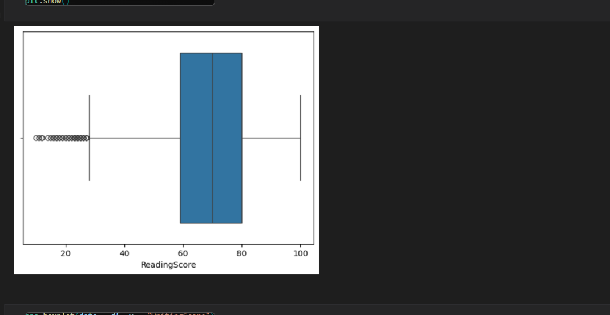

# Student Scores Analysis Project

 As a result of the scores given in this project and other factors, does the marital status of the parents affect the exam scores of their children? Does the education level of the parents affect the exam scores of their children? We will analyze our project through questions such as. We will visually improve our analysis with various graphs such as pie charts, column charts and box charts. We will examine where outliers occur. We will make a fast and effective analysis by making groupings.

## The goal of the project

 The topic we will examine in this data set is the factors affecting students' exam scores.

## Analytics questions:

 -What factors (features) affect test scores most?
 -Are there interacting features which affect test scores?

## Dataset from Kaggle

You can access the data set here (https://www.kaggle.com/datasets/desalegngeb/students-exam-scores).

You can also find the csv file in the project file.

## Data Dictionary (column description)

    Gender: Gender of the student (male/female)
    EthnicGroup: Ethnic group of the student (group A to E)
    ParentEduc: Parent(s) education background (from some_highschool to master's degree)
    LunchType: School lunch type (standard or free/reduced)
    TestPrep: Test preparation course followed (completed or none)
    ParentMaritalStatus: Parent(s) marital status (married/single/widowed/divorced)
    PracticeSport: How often the student parctice sport (never/sometimes/regularly))
    IsFirstChild: If the child is first child in the family or not (yes/no)
    NrSiblings: Number of siblings the student has (0 to 7)
    TransportMeans: Means of transport to school (schoolbus/private)
    WklyStudyHours: Weekly self-study hours(less that 5hrs; between 5 and 10hrs; more than 10hrs)
    MathScore: math test score(0-100)
    ReadingScore: reading test score(0-100)
    WritingScore: writing test score(0-100)

## Libraries

import numpy as np
import pandas as pd
import matplotlib.pyplot as plt
import seaborn as sns

## Usage

1.Download the project file from GitHub

2.Download the libraries.

    pip install numpy
    pip install pandas
    pip install matplotlib
    pip install seaborn

3.Add libraries to your worksheet.

    import numpy as np
    import pandas as pd
    import matplotlib.pyplot as plt
    import seaborn as sns

## Website

For more information about the project, visit my website (https://www.sametyolcu.com/portfolio).