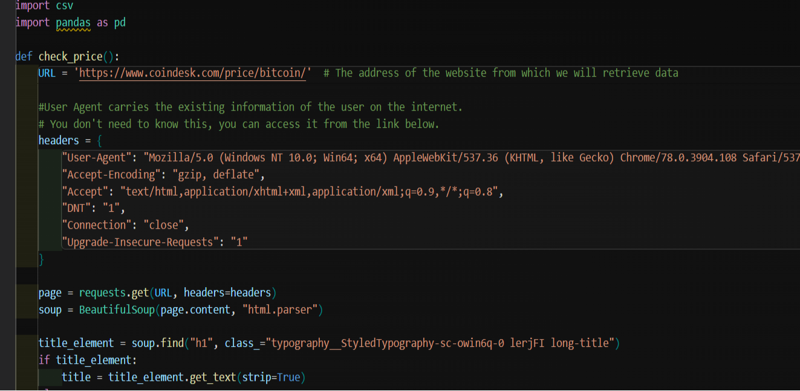
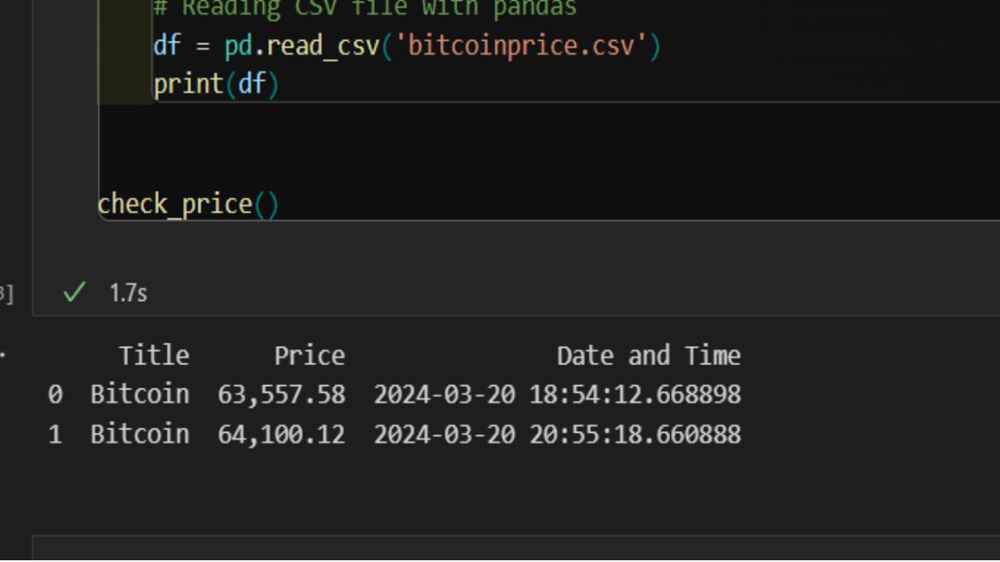
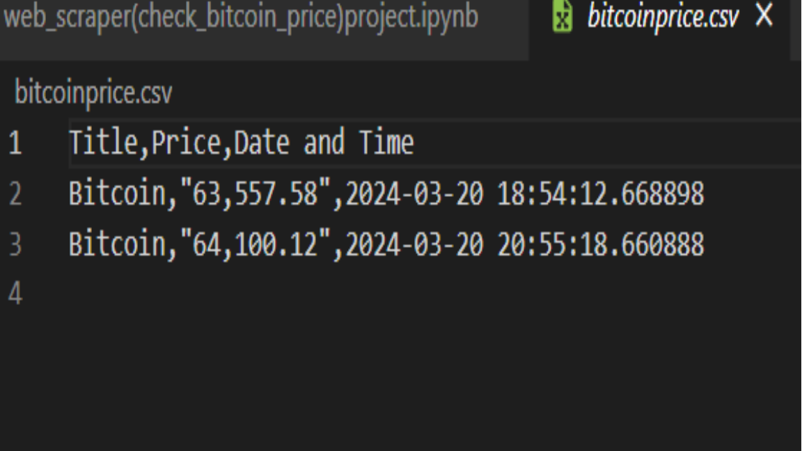

# Bitcoin Price Checker

This project is a simple Python script that fetches Bitcoin prices from the Coindesk website and saves them to a CSV file.It also includes code to automatically run it.



In this project, I tried to make it useful by pulling data from a website I determined.


## How to Run

1. Navigate to the project directory.
2. Run the `bitcoinprice.py` file.
   ```sh
   python bitcoinprice.py

1. The script will fetch Bitcoin prices from the Coindesk website and save them to a CSV file named 
'bitcoinprice.csv'.



## Usage
This script automatically fetches Bitcoin prices from the Coindesk website and saves them to a CSV file. The CSV file appends a new row each time, allowing Bitcoin prices to be tracked over time.



## Requirements
The project requires the following:

Python 3.x
requests library
BeautifulSoup4 library
pandas library

You can install the requirements using the following commands:

pip install requests
pip install beautifulsoup4
pip install pandas

## Contributing

Fork the project
Create a new feature branch ('git checkout -b feature/NewFeature')
Commit your changes ('git commit -am 'Add new feature'')
Push to your branch ('git push origin feature/NewFeature')
Create a new Pull Request


## Website

For more information about the project, visit my website (https://www.sametyolcu.com/portfolio).

Find Your User-Agent: (https://httpbin.org/get).
